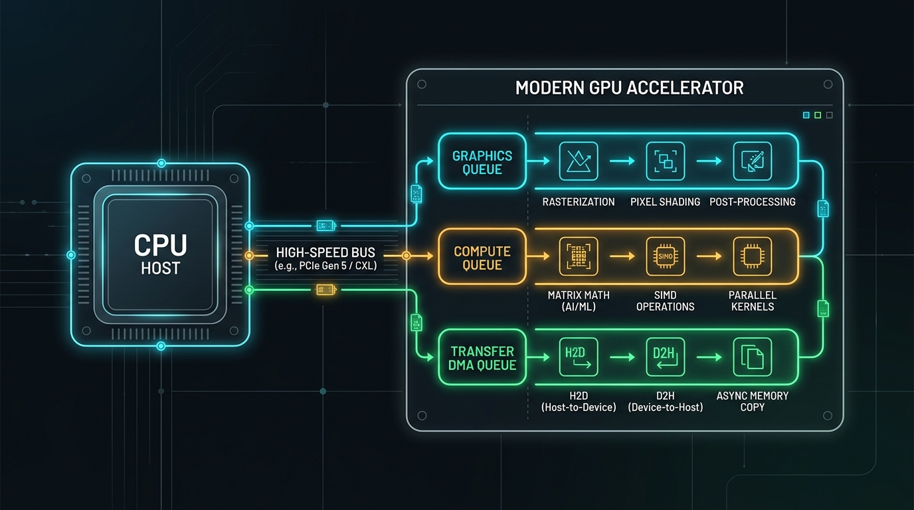
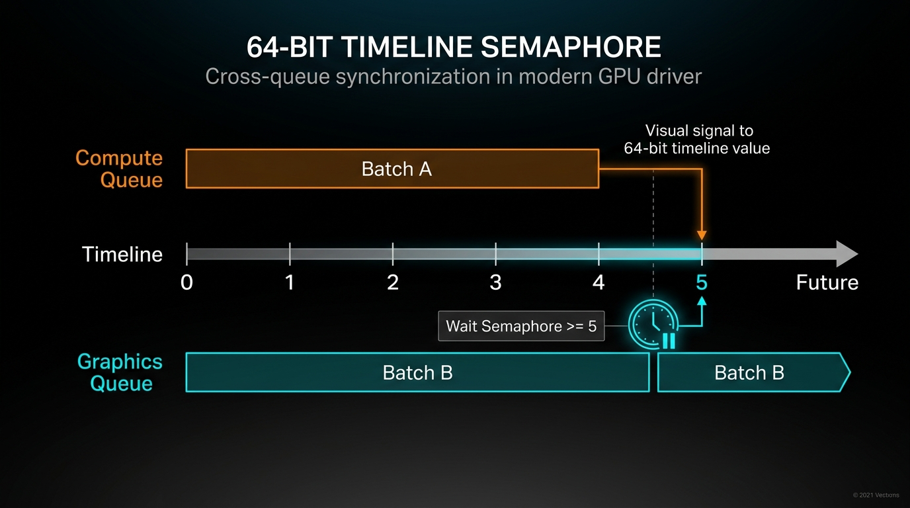
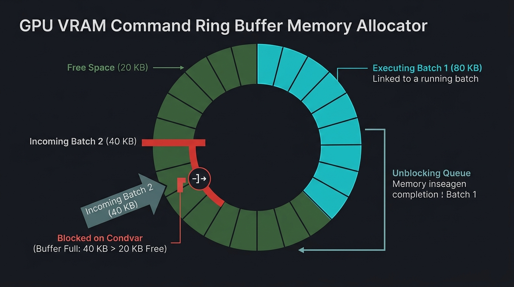

# Simulazione 053 — GpuDispatcher (capstone)

*Esattamente due tratti pubblici, come `TaskGraph` (046), `LockGraph` (048), `SupervisorTree` (049), `SegmentedWal` (050), `CacheBus` (051) e `SwarmCoordinator` (052) — ma qui il problema architetturale esplora l'architettura dei driver grafici e di calcolo eterogeneo moderno (stile Vulkan, Metal e Direct3D 12): un dispatcher GPU multi-coda con semafori timeline a progressione monotona a 64-bit, code di comando concorrenti indipendenti (Graphics, Compute, Transfer), contropressione su ring buffer di memoria VRAM, sincronizzazione incrociata inter-queue senza intervento del processore e recupero da stalli hardware (TDR - Timeout Detection and Recovery). La sfida è coordinare flussi di esecuzione asincroni paralleli con vincoli di memoria e dipendenze incrociate senza deadlock né attese attive.*

---

## GpuDispatcher

Nei moderni sistemi operativi e nelle API grafiche/computazionali a basso overhead (Vulkan, DirectX 12, Metal, WebGPU), il processore centrale (CPU Host) interagisce con l'acceleratore grafico/computazionale (GPU Device) attraverso **code di comando hardware** (`GpuQueue`) multiple e concorrenti (ad esempio `Graphics` per il rendering, `Compute` per il calcolo scientifico o machine learning, e `Transfer` per il trasferimento DMA di memoria).

Ciascuna coda esegue i propri comandi in modo asincrono rispetto alla CPU e parallelamente alle altre code. Tuttavia, nella pipeline di calcolo emergono complesse dipendenze tra code: ad esempio, una coda `Compute` calcola la fisica di una scena, e solo al termine dell'elaborazione la coda `Graphics` può renderizzare i vertici calcolati. Per sincronizzare le code tra loro e con la CPU senza blocchi bloccanti o overhead di polling, le architetture moderne adottano i **Timeline Semaphores**:

1. **Architettura Multi-Coda Eterogenea**:
   - Il processore (CPU Host) e la GPU comunicano tramite code asincrone indipendenti: `Graphics` (rendering di vertici e pixel), `Compute` (elaborazione parallela, matrici, simulazioni fisiche) e `Transfer` (copie DMA ad alta velocità tra memoria Host e memoria Device).
   
   

2. **Semafori Timeline a Progressione Monotona (Cross-Queue Synchronization)**:
   - Un semaforo timeline è associato a un contatore a 64 bit (`u64`) strettamente non decrescente.
   - A differenza dei tradizionali semafori binari, un semaforo timeline rappresenta una linea temporale di avanzamento ($0 \to 1 \to 2 \to \dots \to N$): sottomettendo un batch di comandi, è possibile specificare quali semafori e quali valori di soglia devono essere raggiunti prima che il batch possa iniziare l'esecuzione (`wait_semaphores`), e a quali valori avanzare determinati semafori al completamento del batch (`signal_semaphores`).
   - Quando una coda incontra un batch con `wait_semaphores` non ancora pronti, il worker dedicato di quella coda si sospende passivamente su una `Condvar` senza consumare cicli di CPU. Non appena la coda produttrice termina e avanza il semaforo, la coda consumatrice si sblocca istantaneamente.

   

3. **Contropressione su Ring Buffer di Memoria (VRAM Allocation)**:
   - Ogni coda dispone di un ring buffer circolare di memoria di capacità prefissata (`ring_capacity_bytes`).
   - Ogni batch richiede un quantitativo di memoria per comandi e descrittori (`memory_bytes`). Se la memoria richiesta supera lo spazio attualmente libero nel ring buffer, la chiamata `submit()` deve **sospendere il thread chiamante** senza attesa attiva su una `Condvar` finché l'esecuzione dei batch precedenti non completa, rilasciando memoria.
   - Se la memoria richiesta da un singolo batch è strettamente superiore alla capacità totale del ring buffer della coda, la sottomissione fallisce immediatamente con `Err(GpuError::BatchTooLarge)`.

   

4. **Sincronizzazione Bidirezionale Host-Device**:
   - La CPU può interrogare il valore corrente del semaforo (`read_semaphore`), attendere passivamente che raggiunga un determinato traguardo (`host_wait_semaphore`) o segnalare manualmente un avanzamento (`host_signal_semaphore`), ad esempio per notificare la disponibilità di nuovi dati caricati dalla memoria di sistema.
   - La CPU può invocare `wait_idle()` per sincronizzarsi sul completo drenaggio di tutte le code.
5. **Resilienza ai Guasti Hardware e Timeout (TDR - Timeout Detection and Recovery)**:
   - Se una coda subisce un blocco anomalo o un errore hardware, il dispatcher può emettere un reset (`reset_queue`): tutti i batch in attesa o in esecuzione su quella coda vengono abortiti, la memoria del ring buffer viene azzerata, e tutti i thread o code in attesa di semafori controllati da quella coda vengono risvegliati con l'errore `Err(GpuError::DeviceLost)`.

Si scrivano in Rust le strutture che implementano i tratti `GpuQueue` e `GpuDispatcher` definiti di seguito.

---

### API richiesta

```rust
pub type QueueId = u64;
pub type SemaphoreId = u64;
pub type BatchId = u64;

#[derive(Debug, Clone, Copy, PartialEq, Eq)]
pub enum QueueType {
    Graphics,
    Compute,
    Transfer,
}

#[derive(Debug, Clone, PartialEq, Eq)]
pub enum GpuError {
    /// La coda o il dispositivo ha subito un reset hardware (TDR / Timeout Detection and Recovery).
    DeviceLost,
    /// Il semaforo specificato non esiste.
    InvalidSemaphore,
    /// Il valore del semaforo specificato non è monotonicamente non decrescente rispetto al valore attuale.
    NonMonotonicTimeline,
    /// La dimensione del batch supera la capacità totale del ring buffer della coda.
    BatchTooLarge,
    /// Parametro o operazione non valida.
    InvalidOperation,
}

/// Descrizione di un'operazione o comando eseguito dalla GPU all'interno di un batch.
pub struct GpuCommand {
    /// Costo simulato o tempo stimato per il comando (se utile per telemetria/ordine).
    pub execution_cost_ms: u64,
    /// Azione eseguibile dal comando (eseguita dal worker thread della coda).
    pub action: Box<dyn FnOnce() + Send>,
}

/// Tratto che rappresenta una coda di esecuzione hardware (Graphics, Compute, Transfer).
pub trait GpuQueue: Send + Sync {
    /// Sottomette un batch di comandi alla coda di esecuzione.
    /// - `commands`: lista di comandi da eseguire in sequenza.
    /// - `wait_semaphores`: lista di (SemaphoreId, target_value) da attendere prima di iniziare.
    /// - `signal_semaphores`: lista di (SemaphoreId, signal_value) da impostare al termine.
    /// - `memory_bytes`: occupazione nel ring buffer richiesta da questo batch.
    ///
    /// Se il ring buffer non ha memoria sufficiente per ospitare il batch, il chiamante viene sospeso
    /// senza consumare cicli di CPU finché i batch precedenti non completano l'esecuzione e liberano memoria.
    /// Restituisce il BatchId univoco assegnato al batch.
    fn submit(
        &self,
        commands: Vec<GpuCommand>,
        wait_semaphores: &[(SemaphoreId, u64)],
        signal_semaphores: &[(SemaphoreId, u64)],
        memory_bytes: usize,
    ) -> Result<BatchId, GpuError>;

    /// Restituisce l'ID univoco di questa coda.
    fn queue_id(&self) -> QueueId;

    /// Restituisce la tipologia di questa coda (Graphics, Compute, Transfer).
    fn queue_type(&self) -> QueueType;

    /// Restituisce il numero di batch attualmente in attesa o in esecuzione in questa coda.
    fn pending_batches_count(&self) -> usize;

    /// Restituisce la memoria attualmente occupata nel ring buffer di questa coda.
    fn allocated_ring_bytes(&self) -> usize;
}

/// Tratto che rappresenta il coordinatore centrale del dispositivo GPU e dei semafori timeline.
pub trait GpuDispatcher: Clone + Send + Sync {
    /// Alloca e attiva una nuova coda di esecuzione del tipo specificato con la capacità di ring buffer indicata.
    /// Restituisce l'ID univoco assegnato e il rispettivo handle GpuQueue.
    fn create_queue(&self, queue_type: QueueType, ring_capacity_bytes: usize) -> (QueueId, impl GpuQueue + 'static);

    /// Crea un nuovo semaforo timeline inizializzato con il valore specificato.
    /// Restituisce l'ID univoco assegnato al semaforo.
    fn create_semaphore(&self, initial_value: u64) -> SemaphoreId;

    /// Restituisce il valore di timeline attualmente raggiunto dal semaforo specificato.
    fn read_semaphore(&self, sem: SemaphoreId) -> Result<u64, GpuError>;

    /// Avanza manualmente dal thread host della CPU il valore del semaforo timeline specificato.
    /// Il valore deve essere strettamente maggiore del valore attuale del semaforo, altrimenti
    /// restituisce Err(GpuError::NonMonotonicTimeline).
    /// Risveglia tutti i thread host e le code GPU in attesa di tale valore.
    fn host_signal_semaphore(&self, sem: SemaphoreId, new_value: u64) -> Result<(), GpuError>;

    /// Blocca il thread chiamante (CPU host), senza consumare cicli di CPU, finché il semaforo
    /// specificato non raggiunge un valore maggiore o uguale a `target_value`.
    /// Se il dispositivo o la coda subisce un reset che impedisce il raggiungimento del valore,
    /// restituisce Err(GpuError::DeviceLost).
    fn host_wait_semaphore(&self, sem: SemaphoreId, target_value: u64) -> Result<(), GpuError>;

    /// Blocca il thread chiamante, senza consumare cicli di CPU, finché tutte le code
    /// non hanno completato l'esecuzione di tutti i batch sottomessi.
    fn wait_idle(&self);

    /// Simula un reset hardware (TDR) sulla coda indicata:
    /// tutti i batch in attesa o in esecuzione vengono abortiti con DeviceLost, la memoria
    /// del ring buffer viene azzerata e le attese su semafori sbloccate con errore.
    fn reset_queue(&self, queue: QueueId) -> Result<(), GpuError>;

    /// Restituisce il numero di code attualmente attive.
    fn active_queue_count(&self) -> usize;
}

pub fn make_gpu_dispatcher() -> impl GpuDispatcher {
    ...
}
```

---

### Requisiti

- **Progressione Monotona dei Semafori**:
  - Il valore di ciascun semaforo timeline può solo avanzare (`new_value >= current_value`).
  - L'invocazione di `host_signal_semaphore` con `new_value <= current_value` restituisce `Err(GpuError::NonMonotonicTimeline)`.
- **Risoluzione delle Dipendenze Inter-Queue**:
  - Ciascuna coda possiede un thread di esecuzione dedicato che elabora i batch sottomessi in ordine FIFO.
  - Prima di iniziare l'esecuzione di un batch, la coda deve verificare che per ogni `(sem_id, target_val)` in `wait_semaphores`, il semaforo abbia raggiunto un valore `value >= target_val`. Se anche un solo semaforo non è pronto, il worker si sospende su `Condvar` senza consumare CPU.
  - Quando il batch termina, il worker aggiorna atomicamente tutti i semafori in `signal_semaphores` con `sem.value = max(sem.value, signal_val)` e notifica i thread in attesa.
- **Contropressione su Ring Buffer**:
  - `submit()` deve verificare che `memory_bytes <= ring_capacity_bytes`, altrimenti restituisce `Err(GpuError::BatchTooLarge)`.
  - Se `allocated_ring_bytes + memory_bytes > ring_capacity_bytes`, il chiamante si sospende su `Condvar`. Quando un batch termina l'esecuzione, la sua memoria viene restituita e i produttori sospesi vengono risvegliati.
- **Sincronizzazione Host Senza Busy-Waiting**:
  - `host_wait_semaphore` e `wait_idle` devono sospendere il thread chiamante su `Condvar` senza spin.
- **Resilienza TDR e Reset**:
  - `reset_queue(q)` imposta la coda in stato di errore (`DeviceLost`). Eventuali batch in volo vengono rimossi, la memoria del ring buffer viene liberata e i thread in attesa su semafori dipendenti vengono risvegliati con `Err(GpuError::DeviceLost)`.
- **Gestione RAII (`Drop`) di `GpuQueue`**:
  - Quando un handle `GpuQueue` viene distrutto (`Drop`), la coda completa i batch pendenti (o viene fermata in modo pulito), la memoria viene deallocata e `active_queue_count()` viene decrementato.
- **Thread-Safety & Suite di Test**:
  - Il dispatcher deve essere condivisibile tra thread (`Clone + Send + Sync`).
  - I test in `tests/shared_tests.rs` devono passare senza modifiche (`cargo test`).
  - Se il codice consegnato non compila, non verrà valutato.

---

### Suggerimenti implementativi

1. Rappresentare lo stato globale con una struttura interna protetta da un `Mutex<(DispatcherState, Condvar)>`:
   - Una tabella dei semafori: `HashMap<SemaphoreId, u64>`.
   - Una tabella delle code: `HashMap<QueueId, QueueState>`.
   - Un flag o insieme di code che hanno subito `DeviceLost`.
2. Per ciascuna coda, mantenere:
   - Una coda FIFO di batch pendenti: ciascun batch contiene i comandi, le dipendenze di attesa, i segnali da emettere e la memoria occupata.
   - Il contatore di memoria occupata `allocated_memory` e la capacità massima `ring_capacity`.
   - Il thread worker della coda, avviato alla creazione di `create_queue`.
3. Nel ciclo del worker:
   - Acquisire il lock, verificare se la coda è in vita e se il batch in testa ha tutti i `wait_semaphores` soddisfatti. In caso contrario, attendere sulla `Condvar`.
   - Estrarre il batch, rilasciare il lock ed eseguire i comandi (`execution_cost_ms`).
   - Riacquisire il lock, aggiornare i `signal_semaphores`, decrementare `allocated_memory` e svegliare tutti i thread tramite la `Condvar`.
4. Nel metodo `host_wait_semaphore(sem, target)`, utilizzare `cvar.wait_while` verificando sia il valore del semaforo, sia se il dispositivo ha subito un reset incompatibile.

---

## Meta-commentario

**Perché `GpuDispatcher` raggiunge la massima complessità architetturale (Score 5.0+):**
I capstone precedenti hanno affrontato problemi di caching hardware (`CacheBus`) e coordinamento decentralizzato P2P (`SwarmCoordinator`). `GpuDispatcher` porta la concorrenza nel dominio dei moderni sottosistemi di calcolo eterogeneo (Vulkan/Metal/CUDA):
- Il modello non è un semplice worker pool né una coda MPMC: è una rete di code di esecuzione parallele con **dipendenze asincrone a semaforo timeline**, in cui una singola coda non può procedere a meno che altre code indipendenti non abbiano raggiunto specifici traguardi temporali.
- La combinazione di **contropressione su memoria ring buffer** e **sincronizzazione inter-queue** crea scenari ad alto rischio di stallo e inversione di priorità se il rilascio delle risorse e l'avanzamento dei semafori non sono perfettamente sincronizzati.

**La scoperta architetturale chiave: il semaforo timeline come primitiva unificata host-device:**
I tradizionali semafori binari richiedono un reset esplicito prima del riutilizzo, esponendo il sistema a race condition su cicli multipli. Il semaforo timeline monotonically increasing converte la sincronizzazione in un confronto d'ordine ($V_{actual} \ge V_{target}$). Ciò consente a più code e thread host di attendere lo stesso traguardo o traguardi futuri della medesima timeline senza corrompere lo stato, garantendo idempotenza e sicurezza formale.

**Difficoltà stimata:** 5.0+ / 5.0. Budget stimato: 130–160 minuti.
