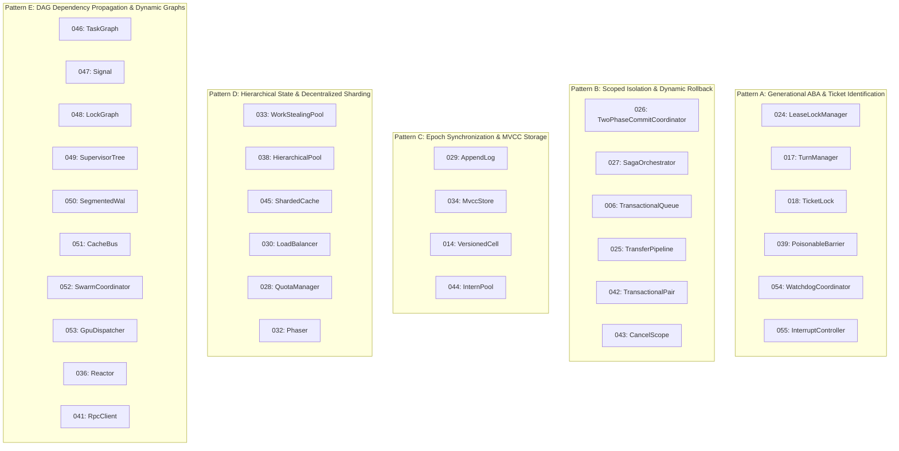

# 🎓 Simulation Traceability & Mastery Matrix (Simulations 01 — 47)
### Programmazione di Sistema — Prof. G. Malnati (Politecnico di Torino)

This traceability matrix maps and classifies all simulations created in the preparation suite. It tracks structural complexity, novelty/unique architectural tricks, alignment with Prof. Malnati's reverse-engineered 2026 exam patterns, and structural justification.

---

## 📊 1. Full Traceability Matrix (Scale 0.0 – 5.0)

| ID | Name | Domain & Nature | Structural Complexity (0-5) | Novelty / Unique Tricks (0-5) | 2026 Exam Pattern Alignment (0-5) | Traits Count | Key Architectural Traits & Structures |
| :---: | :--- | :--- | :---: | :---: | :---: | :---: | :--- |
| **01** | `EventBus` | Pub-Sub Event Bus | 2.5 | 3.0 | 3.5 | 2 | `EventBus`, `Subscription` (RAII token removal on Drop) |
| **02** | `WorkProducer/Consumer` | MPMC Queue with Cancel | 2.0 | 2.0 | 3.0 | 2 | `Producer`, `Consumer` (Cancellation token) |
| **03** | `Exchanger` | Thread Rendezvous | 3.5 | 4.0 | 4.0 | 2 | `Exchanger`, `ExchangeSession` (Pairwise synchronization) |
| **04** | `TaskExecutor` | Priority Scheduler | 3.0 | 3.0 | 3.5 | 2 | `TaskExecutor`, `TaskHandle` (Background worker, deadline queue) |
| **05** | `BoundedQueue` | Circular Buffer Backpressure | 2.0 | 1.5 | 3.0 | 2 | `QueueSender`, `QueueReceiver` |
| **06** | `TransactionalQueue` | 2-Phase Queue with Rollback | 3.0 | 3.5 | 4.0 | 2 | `TxQueue`, `Transaction` (Uncommitted staging, atomicity) |
| **07** | `RwCell` | Custom RW Synchronization | 2.0 | 2.0 | 2.5 | 2 | `RwCell`, `ReadGuard`/`WriteGuard` |
| **08** | `DelayQueue` | Timed Delayed Queue | 3.5 | 4.0 | 4.5 | 2 | `DelayQueue`, `DelayedItem` (Dynamic `wait_timeout` computation) |
| **09** | `WaitGroup` | Synchronization Barrier | 3.0 | 3.0 | 3.5 | 2 | `WaitGroup`, `WaitToken` |
| **10** | `AsyncResourcePool` | Async Resource Loan | 3.5 | 4.0 | 3.5 | 2 | `AsyncPool`, `AsyncResource` (Tokio async loan) |
| **11** | `MultiResourceManager` | Multi-Key Resource Acquisition | 4.0 | 4.5 | 4.5 | 2 | `ResourceManager`, `ResourceBundle` (Ordered multi-lock acquisition) |
| **12** | `MetricsBoard` | Concurrent Metrics Snapshot | 3.0 | 3.5 | 4.0 | 2 | `MetricsBoard`, `MetricHandle` (Atomic snapshot, dynamic name recycling) |
| **13** | `AgingScheduler` | Dynamic Priority Scheduler | 4.0 | 4.0 | 4.5 | 2 | `AgingScheduler`, `ScheduledTask` (Aging rate, priority boost) |
| **14** | `VersionedCell` | Optimistic Concurrency Control | 3.0 | 3.5 | 3.5 | 2 | `VersionedCell`, `VersionSnapshot` (OCC, atomic CAS versioning) |
| **15** | `SingleFlightCache` | Request Coalescing Cache | 3.5 | 4.0 | 4.0 | 2 | `SingleFlightCache`, `FlightHandle` (Thundering-herd suppression) |
| **16** | `BatchPool` | Dynamic Batch Worker Pool | 3.5 | 4.0 | 4.0 | 2 | `BatchPool`, `BatchTicket` (Timed + capacity batch triggers) |
| **17** | `TurnManager` | Sequential Turn Coordinator | 3.5 | 4.0 | 4.5 | 2 | `TurnManager`, `TurnToken` (Generational turn rotation) |
| **18** | `TicketLock` | Fair FIFO Spin/Block Lock | 3.5 | 4.0 | 4.0 | 2 | `TicketLock`, `TicketGuard` (Ticket-and-turn lock fairness) |
| **19** | `Broadcast` | Broadcast Channel Iterator | 3.0 | 3.5 | 3.5 | 2 | `BroadcastSender`, `BroadcastReceiver` (Custom `Iterator`) |
| **20** | `TickerService` | Periodic Callback Dispatcher | 2.5 | 3.0 | 3.0 | 2 | `TickerService`, `TickerHandle` (`FnMut` callbacks, unlocked dispatch) |
| **21** | `TtlCache` *(Capstone)* | LRU + TTL + Single-Flight | 4.5 | 5.0 | 5.0 | 2 | `TtlCache`, `CacheEntry` (Per-key Condvar, LRU eviction, TTL) |
| **22** | `JobScheduler` *(Capstone)* | Multi-Worker Resource Pipeline | 4.5 | 4.5 | 5.0 | 2 | `JobScheduler`, `JobHandle` (Multi-resource constraints, aging) |
| **23** | `CircuitBreaker` | Failure-Domain Circuit Breaker | 3.5 | 4.0 | 4.5 | 2 | `CircuitBreaker`, `CircuitProbe` (Half-open single-winner probe, recovery) |
| **24** | `LeaseLockManager` *(Capstone)* | Distributed Lease Lock | 5.0 | 5.0 | 5.0 | 2 | `LeaseLockManager`, `Lease` (ABA generation, reaper thread, heartbeat) |
| **25** | `TransferPipeline` *(Capstone)* | Staged Processing Pipeline | 4.5 | 4.5 | 5.0 | 2 | `TransferPipeline`, `StageToken` (Staged pipeline, atomic retry/abort) |
| **26** | `TwoPhaseCommitCoordinator` *(Capstone)* | Distributed 2PC Coordinator | 4.5 | 4.5 | 5.0 | 2 | `Coordinator`, `Participant` (`Box<dyn Participant>` Send-only bridge, selective abort) |
| **27** | `SagaOrchestrator` *(Capstone)* | Saga Transaction Orchestrator | 4.5 | 4.5 | 5.0 | 2 | `SagaOrchestrator`, `SagaStep` (Reverse rollback `(0..i).rev()`, orphan timeouts) |
| **28** | `QuotaManager` | Hierarchical Rate Limiter | 3.5 | 4.0 | 4.5 | 2 | `QuotaManager`, `QuotaReservation` (Per-tenant + global aggregate quotas) |
| **29** | `AppendLog` *(Capstone)* | Epoch-Synchronized WAL | 4.5 | 5.0 | 5.0 | 2 | `AppendLog`, `LogHandle` (Epoch synchronization, non-blocking checkpoint) |
| **30** | `LoadBalancer` | Health-Checked Request Router | 4.0 | 4.5 | 4.5 | 2 | `LoadBalancer`, `BackendHandle` (Multi-state health cooldown, least-loaded) |
| **31** | `CreditedChannel` | HTTP/2 Credit Flow Channel | 3.0 | 4.0 | 4.0 | 2 | `CreditSender`, `CreditReceiver` (Explicit stream credits) |
| **32** | `Phaser` | Multi-Phase Dynamic Barrier | 4.0 | 4.5 | 4.5 | 2 | `Phaser`, `PhaseRegistration` (Dual-trigger arrive/deregister progression) |
| **33** | `WorkStealingPool` *(Capstone)* | Decentralized Work Stealing | 4.5 | 5.0 | 5.0 | 2 | `WorkStealingPool`, `WorkerHandle` (Decentralized LIFO/FIFO queues, push cvar) |
| **34** | `MvccStore` *(Capstone)* | Multi-Version Concurrency Store| 5.0 | 5.0 | 5.0 | 2 | `MvccStore`, `Snapshot` (Logical clock, $O(1)$ snapshot, Drop-driven vacuum) |
| **35** | `LeaderElection` *(Capstone)* | Raft Leader Consensus | 5.0 | 5.0 | 5.0 | 2 | `Elector`, `VoteCollector` (Parallel quorum, dual early-return victory/defeat) |
| **36** | `Reactor` *(Capstone)* | I/O Readiness Multiplexer | 4.5 | 4.5 | 5.0 | 2 | `Reactor`, `Registration` (Disjunctive event wait, urgent priority drain) |
| **37** | `PriorityLock` *(Capstone)* | Priority Inheritance Mutex | 5.0 | 5.0 | 5.0 | 2 | `PriorityLock`, `PriorityGuard` (Observable priority inheritance, max recalculation) |
| **38** | `HierarchicalPool` *(Capstone)* | Two-Tier Cache & Overflow | 4.5 | 4.5 | 5.0 | 2 | `HierarchicalPool`, `PooledItem` (Thread-local cache + shared overflow, Drop routing) |
| **39** | `PoisonableBarrier` | Poisonable Cyclic Barrier | 4.0 | 4.0 | 4.5 | 2 | `Barrier`, `BarrierToken` (Poison propagation, multi-generation abort) |
| **40** | `VirtualMemory` *(Capstone)* | Page Frame Manager & TLB | 4.5 | 4.5 | 5.0 | 2 | `PageTable`, `FrameGuard` (Page fault resolution, frame allocation) |
| **41** | `RpcClient` | Multiplexed RPC Client | 4.0 | 4.0 | 4.5 | 2 | `RpcClient`, `PendingCall` (Correlation ID dispatch, timeout cancellation) |
| **42** | `TransactionalPair` *(Capstone)* | Two-Resource Distributed Tx | 4.5 | 4.5 | 5.0 | 2 | `TxCoordinator`, `TxHandle` (Strict lock-order 2-resource atomic commit/rollback) |
| **43** | `CancelScope` *(Capstone)* | Structured Concurrency Scope | 4.5 | 4.5 | 5.0 | 2 | `CancelScope`, `ScopeHandle` (Tree-structured hierarchical cancellation propagation) |
| **44** | `InternPool` *(Capstone)* | Deduplicating String/Data Interner | 4.5 | 4.5 | 5.0 | 2 | `InternPool`, `InternedSymbol` (Weak-reference count, GC on symbol Drop) |
| **45** | `ShardedCache` *(Capstone)* | Dynamic Rehash Sharded Cache | 4.5 | 4.5 | 5.0 | 2 | `ShardedCache`, `CacheShard` (Per-shard locks + world-stop dynamic rehash coordination) |
| **46** | `TaskGraph` *(Capstone)* | Dependency DAG Task Runner | 5.0 | 5.0 | 5.0 | 2 | `TaskGraph`, `TaskHandle` (DAG reverse-edges, cascade fail/cancel, dual condvars, workers) |
| **47** | `Signal` *(Capstone)* | Qt/Boost Reentrant Signals & Slots | 4.5 | 4.5 | 5.0 | 2 | `Signal`, `Connection` (Snapshot iteration, reentrant self/cross disconnection, non-blocking) |
| **48** | `LockGraph` *(Capstone)* | Dynamic WFG & Deadlock Detection | 5.0 | 5.0 | 5.0 | 2 | `LockManager`, `TxHandle` (Wait-For-Graph DFS cycle detection, victim abort cascade, Shared/Exclusive locks, Drop cleanup) |
| **49** | `SupervisorTree` *(Capstone)* | Fault-Tolerant Actor Supervision | 5.0 | 5.0 | 5.0 | 2 | `Supervisor`, `ActorRef` (OneForOne/AllForOne sibling cascade, flapping rate-limit window, ask crash unblock, Dead-Letters) |
| **50** | `SegmentedWal` *(Capstone)* | Segmented WAL, Pin Leases & Write-Stall | 5.0+ | 5.0 | 5.0 | 2 | `SegmentedWal`, `ReaderLease` (Segment rotation, pin-counted leases, Low Watermark, Write-Stall backpressure, Drop unpin) |
| **51** | `CacheBus` *(Capstone)* | Hardware MESI Snooping Bus & Store Buffer | 5.0+ | 5.0 | 5.0 | 2 | `MemoryBus`, `CoreCache` (MESI cache line protocol, bus broadcast snooping, store buffer drain, memory barrier Condvar, Drop flush) |
| **52** | `SwarmCoordinator` *(Capstone)* | P2P Torrent Swarm, Speculative Endgame & Integrity | 5.0+ | 5.0 | 5.0 | 2 | `SwarmCoordinator`, `PeerSession` (Rarest-First scheduling, Endgame Mode cross-peer cancellation, Choke revocation, out-of-lock cryptographic verification, Drop unregister) |
| **53** | `GpuDispatcher` *(Capstone)* | Heterogeneous GPU Queues & Timeline Semaphores | 5.0+ | 5.0 | 5.0 | 2 | `GpuDispatcher`, `GpuQueue` (Monotonic 64-bit timeline fences, inter-queue async dependencies, ring buffer VRAM backpressure, host sync, TDR fault reset) |
| **54** | `WatchdogCoordinator` *(2026 Exam-Calibrated)* | Dead-Man's Switch, Heartbeat Leases & Liveness Monitoring | 4.0 | 5.0 | 5.0 | 2 | `Watchdog`, `WatchdogLease` (Earliest-deadline sleep on Condvar, heartbeat lease renewals, RAII clean drop vs trip alarm, shutdown) |
| **55** | `InterruptController` *(2026 Exam-Calibrated)* | OS Kernel Programmable Interrupt Controller & EOI Arbiter | 4.0 | 5.0 | 5.0 | 2 | `InterruptController`, `IrqSession` (Dynamic IPL priority masking, priority arbitration, RAII EOI restoration on Drop, shutdown) |

---

## 🗺️ 2. Architectural Archetypes Taxonomy

---

## 📌 3. Strict Rules for Adding New Simulations (Simulation 48+)
1. **Never Re-Use an Existing Domain**: Verify that the domain does not duplicate or trivially reskin any of the 47 domains above.
2. **Require at Least 2 Traits**: Always specify an aggregate/coordinator service trait and at least one unit/session/handle trait.
3. **Calibrate Structural Complexity to Simulation 46**:
   - The solution must require at least 3–4 cooperating internal structures (e.g. `CoordinatorState`, `NodeEntry`, `HandleRef`, `PendingQueue`).
   - Must demand discovering a non-obvious internal relationship (e.g. reverse edges, generational fencing, dual condvars, or level of indirection).
4. **Always Ground in Reverse-Engineered Patterns**:
   - Follow the 3-Tier Architecture (`SharedState` -> `ServiceStruct` -> `HandleStruct`).
   - Clean RAII Drop or explicit transaction lifecycle.
   - Non-blocking lock drop before calling user closures.
   - Opaque RPITIT factory function.
